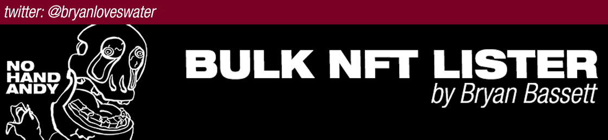

# Bulk list your polygon NFT collection on opensea

This is for people who have a very large collection already minted on polygon and want to list them all for sale. This is not for uploading new collections. Writing your own smart contract and minting thousands of items on polygon is fast and simple and you don't have to care about captcha getting in the way, but then listing them all for sale? That's not easy, nor quick - BUT this solves that and luckily, as of now, opensea has no captcha for the listing for sale process.

Also - if you dont own a few in the series of numbers, or have them already listed, it will automatically skip and continue on in the process!

This code is heavily inspired by a few others I've seen around github that did the full upload process, but captcha issue pretty much makes them all useless. Mint your own contract and use fractions of cents to mint your entire collection. Doing so with polygon MATIC is not that hard of a process it turns out.

If you want to support this project or me, please check out my NFTs  
<https://opensea.io/collection/no-hand-andy>  

# Changelog

  <ul>
    <li><b>Version 1.0.0 Released 3/24/2022</b></li>
  </ul>

# Instructions

<ul>
  <li>Download and extract this project in your local device (keep all files and folders that come with the repo in this folder)</li>
  <li>Download and update Python. My python version is 3.8.10</li>
   <li>Open this project folder with any command prompt and click "open with powershell " or "Terminal"</li>
   <li>Install all the requirements by running the following command (pip install -r requirements.txt)  
       Please install PIP for Python if “pip is not recognized as an internal or external command</li>
   <li>Run the script, type "python bulklistforsale.py" (i have multiple versions of pythons so i have to type "python3 bulklistforsale.py" </li>
   <li>Once running the script, will pop-up the application </li>
   <li>Fill in the variables for your project</li>
     <ul>
       <li>
        <ul>
        <li> Opensea collection url:https://opensea.io/assets/matic/0xc47d128849ee35597098d3df48529ec2d1dd517e </li>
          <li>(this is your contract URL, which you see once clicking into one of your items) </li>
          <li>click into one of your items and the URL will look like: https://opensea.io/assets/matic/0xc47d128849ee35597098d3df48529ec2d1dd517e/614 </li>
          <li>you need everything up until that last backslash</li>
        </ul>
       </li>
        <li>Start number 1</li>
        <li>End number 9999 or any number</li>
        <li>Default price: 0.005</li>
     </ul>
   <li>Click and “save this form”</li>
      <li>close any currently open chrome browsers</li>
     <li>Click “open chrome browser” will popup a new chrome browser, login / sign-in your metamask account. Download metamask extension if don’t have it</li>
     <li>And click “start” to let it run.</li>
  </ul>

# Checklist before you press the "start" button

<ul>
   <li>Disabled opensea night mode</li>
</ul>

# ChromeDriver - WebDriver for Chrome

Download your compatible chromedriver.exe <https://chromedriver.chromium.org/downloads>, replace the once currently in the folder

# Message for a MacOS user

Currently this script only tested in Windows 11. Not compatible for MacOS.

# Contact me

If you have any questions or want to get in contact you can find me on twitter by searching @bryanloveswater

# Thanks

Please share and leave a star 
If you found it useful, buy me a coffee( i like coffee :),  
Paypal: <https://paypal.me/bryanbassett1> 
Ethereum address: <B>0xbbD4Dd9FBAF74f5CBF58B143Bb5029936DA6fD26</b> 
Thank you very much 

